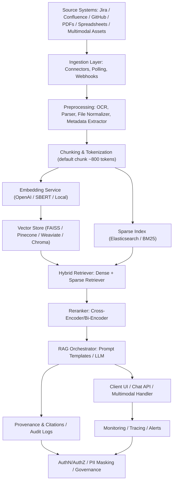

# EnterpriseRag

EnterpriseRag is a production-grade reference design and implementation guide for a Retrieval-Augmented Generation (RAG) system that ingests and serves enterprise knowledge: Jira, Confluence, GitHub, PDFs, spreadsheets, multimedia assets (images/audio/video), and other structured data. This README provides a complete architecture, operational guidance, retrieval process, tooling recommendations, and tuning parameters so teams can implement a secure, auditable, and high-quality RAG solution.

- Status: design / reference architecture
- Audience: SREs, ML engineers, data engineers, platform architects, product managers
- Goals: high recall, high precision, verifiable citations, low hallucination, scalable indexing, fast retrieval, secure governance

Table of Contents
- Overview
- Architecture diagram
- Data sources
- Ingestion layer
- Preprocessing and normalization
- Chunking & document representation
- Embeddings & vectorization
- Sparse index (keyword search)
- Hybrid retrieval & reranking
- RAG orchestration and LLM prompt patterns
- Multimodal & spreadsheets handling
- Provenance, citations & audit logging
- Monitoring, observability & SLOs
- Security, privacy & governance
- Scaling, reliability & disaster recovery
- CI/CD, infra & deployment
- Feedback loops, evaluation & continuous improvement
- Operational playbooks & troubleshooting
- Retrieval walkthrough (end-to-end step flow)
- Recommended parameters & sample configs
- Next steps

---

## Architecture diagram

Paste this Mermaid diagram into GitHub (if Mermaid rendering is enabled) or use as reference in docs. Node IDs are simplified to avoid Mermaid parse errors.



---

## Overview

EnterpriseRag organizes enterprise knowledge into a hybrid retrieval system, combining dense vector-based semantic search with sparse, keyword-based search. It ensures traceable responses by attaching provenance for every returned passage. The architecture emphasizes:

- Source fidelity (store originals)
- Reproducible indexing
- Access control and privacy
- Scalable retrieval and low-latency inference
- Human-in-the-loop feedback and continuous evaluation

---

## 1) Data sources (what to ingest)

- Jira
  - Issue title, description, comments, attachments, custom fields, status, resolution, labels, timestamps, assignee
- Confluence
  - Page content, page history/versions, comments, attachments, space and page metadata
- GitHub
  - Repos, README.md, source code files, issues, PRs, release notes, actions logs (optional)
- PDFs & Office Documents
  - PDF, DOCX, PPTX, preserving layout metadata and page numbers
- Spreadsheets
  - XLSX, CSV, Google Sheets: sheet names, headers, rows, formulas (optional), cell-level metadata
- Multimedia
  - Images, diagrams, screenshots (OCR + captioning)
  - Audio: call recordings (ASR transcripts)
  - Video: keyframes + transcripts
- External systems
  - Knowledge bases, product catalogs, support ticket systems, CRM exports

Recommend keeping raw originals in an object store (S3/GCS/Azure Blob) for compliance and reprocessing.

---

## 2) Ingestion layer

Connector design:
- Dedicated connector per source (Jira REST API, Confluence API, GitHub GraphQL/REST, Google Drive/Sheets, S3)
- Modes:
  - Webhooks for near-real-time events (preferred where available)
  - Polling for periodic sync
  - Bulk backfill for historical data
- Incremental sync:
  - Use last-modified timestamps, version numbers, or webhooks
  - Track per-source cursor (checkpoint) in durable store
- Resiliency:
  - Message queue (Kafka/SQS/PubSub) between connector and processors for backpressure and retries
  - Idempotent ingestion via checksums/document versioning

Store these artifacts:
- Raw file blob
- Extracted text + metadata
- Chunked segments
- Embeddings
- Indexing status and audit logs

---

## 3) Preprocessing & normalization

- File type detection (MIME-based and header checks)
- Extract text and structure:
  - PDFs: PDFMiner / Apache PDFBox / commercial parsers; preserve pages and headings
  - DOCX/PPTX: unzip + XML extraction to preserve structural tags
- OCR for scanned documents:
  - Tesseract or commercial OCR (Google Vision, AWS Textract)
  - Keep bounding-box and page references
- ASR for audio/video:
  - Use Whisper / cloud ASR / vendor model; keep timestamps for segments
- Image captioning:
  - CLIP+caption model to create searchable captions
- Language detection, tokenization, normalization, Unicode normalization
- Metadata extraction:
  - author, created_at, updated_at, file path, source URL, labels/tags
- PII detection & classification:
  - Optional redaction or tokenization step for sensitive fields

---

## 4) Chunking & document representation

- Chunking strategy:
  - Default chunk length: 700–1200 tokens (depend on LLM context; 800 is reasonable)
  - Stride (overlap): 50–300 tokens to preserve context across chunk boundaries
  - Respect semantic boundaries (section headers, paragraphs)
- Special handling:
  - Tables: chunk by logical rows/blocks, include header rows as context
  - Code files: chunk by function/class or logical blocks, preserve file path & line range
  - Transcripts: chunk by speaker turn or time window (e.g., 30–60s)
- Attach metadata to each chunk:
  - source_id, doc_id, chunk_id, start_token, end_token, page, sheet name/cell range, URL

---

## 5) Embeddings (dense vectors)

- Models:
  - Cloud: OpenAI text-embedding-3 / text-embedding-3-small
  - OSS: Sentence-BERT (SBERT), HuggingFace embedding models
  - Multimodal: CLIP-style embeddings for images (paired with text embeddings via late-fusion)
- Best practices:
  - Batch embedding generation for throughput
  - Upsert semantics with doc+chunk id
  - Embedding dimensionality: consider storage & index algorithm tradeoffs
  - Quantization for storage (PQ, IVF, HNSW with quantization)
- Deduplication:
  - Compute content fingerprints to avoid duplicate vectors
- Re-embedding strategy:
  - Recompute when embedding model changes
  - Use versioning to mark vector embeddings with model version

---

## 6) Sparse index (keyword search)

- Engine: Elasticsearch / OpenSearch (BM25) or other Lucene-based systems
- Use cases: metadata filtering, exact match, structured queries
- Analyzer & mappings:
  - Language analyzers (English, others)
  - N-grams for short query enrichment (e.g., product codes)
  - Fields: title, content, content_summary, tags, modified_at
- Keep per-chunk documents in the index with references to chunk id in vector DB

---

## 7) Vector store choices & config

- Options:
  - On-prem / self-hosted: FAISS with disk-backed IVF/PQ, Milvus
  - Managed: Pinecone, Weaviate, Chroma (hosted), Redis Vector
- Requirements:
  - ANN algorithm (HNSW, IVF-PQ), persistence, metric (cosine vs dot), metadata filtering, upserts, backups
- Considerations:
  - Latency vs cost (HNSW is fast, memory heavy)
  - Sharding & partitioning for very large corpora
  - Snapshots for disaster recovery

---

## 8) Hybrid retrieval (dense + sparse)

- Workflow:
  1. Apply metadata filters (project, date, access control)
  2. Run sparse retrieval (BM25) -> top_k_sparse
  3. Run dense retrieval (ANN on vector store) -> top_k_dense
  4. Merge candidate sets, deduplicate by doc_id
  5. Apply reranker on merged top candidates (optional cross-encoder)
- Merging strategies:
  - Union (combine top results from both)
  - Weighted fusion (score normalization then weighted sum)
- Typical parameters:
  - top_k_dense: 50
  - top_k_sparse: 100
  - merged_limit: 150
  - final_rerank_top_k: 30 -> final return 5–10

---

## 9) Reranking & final scoring

- Lightweight rerankers:
  - Logistic/regression model combining vector similarity, BM25 score, recency, source authority
- Cross-encoder rerankers:
  - BERT-style cross-encoders evaluate query+passage together for higher precision
  - More accurate but computationally expensive: use on a small candidate set
- Features to use:
  - Similarity scores, BM25 score, source_priority, is_document_title_match, recency_boost

---

## 10) RAG orchestration & LLM step

- Prompt template structure:
  - System instruction: role + constraints (e.g., "Use only given sources, cite sources, say 'I don't know' if unsupported")
  - Few-shot examples (optional, show desired format & citation style)
  - Retrieved passages numbered with citations (e.g., [1], [2a])
  - User question
  - Generation instructions (answer length, format, citation requirement)
- Response format requirement (example):
  - Short summary (2–4 bullet points)
  - Supporting passages with citations (list of sources used with doc_id & excerpt)
  - Confidence score (optional)
- Guardrails:
  - Explicit "do not hallucinate" instructions
  - If contradictory evidence exists, show conflicting sources and dates
  - Limit tokens, temperature tuned low (0–0.2) for factual outputs
- Post-process:
  - Attach provenance metadata to response
  - Run hallucination detectors (e.g., check facts vs sources)
  - Redact PII if necessary

Example prompt snippet (structure):
```text
System: You are an assistant that answers only from the provided documents. Cite any statements with the passage id.
Documents:
[1] Confluence: "Release plan v2" (page 3): "API v2 launches on 2026-01-15..."
[2] Jira ticket PROJ-42: "Feature spec: ..."
Question: When does API v2 launch?
Answer: ...
Citations: [1]
```

---

## 11) Multimodal handling

- Images:
  - OCR text extraction
  - Image captioning (generate textual description)
  - Image embeddings (CLIP) for visual similarity
  - If query references images, include image captions and key region OCR as passages
- Audio / Video:
  - ASR transcripts with timestamps
  - Per-segment embeddings
  - Keyframes extracted for visual context + embeddings
- Multimodal query routing:
  - Detect modality (natural language vs image upload)
  - For image + text queries do multi-encoder retrieval and fuse results
- Example: "Show me the diagram explaining X" -> search image captions & associated textual explanations

---

## 12) Spreadsheets & structured data

- Flatten spreadsheets into rows with contextual headers as passages:
  - e.g., Row chunk: "Sheet=Budget, Row=12, Columns: Department=..., Q1=..., Q2=..."
- Keep cell references in metadata for precise citation (e.g., sheet name + cell range)
- For numeric/aggregate queries:
  - Run a small data-processing step (SQL-like) before LLM to supply computed values
  - Avoid forcing LLM to compute from noisy textual summaries
- Preserve formulas only if necessary for provenance

---

## 13) Provenance, citations & audit logging

- Mandatory for enterprise use:
  - Every returned excerpt must include: source id, doc title, page/sheet/line, document URL
- Persist for each query:
  - user_id, query_text, request_time, returned_doc_ids, embedding_model_used, LLM_model_used, final_response
- Store raw prompt + LLM response for audits and retraining
- Provide "view original" links for users to inspect source documents

Citation format example:
- Inline: "According to Confluence: '...' [Confluence: Space/PageName#p3]"
- Structured metadata returned by API:
```json
{
  "answer": "The API v2 launch is 2026-01-15.",
  "citations": [
    { "source": "confluence", "id": "space/page", "page": 3, "url": "https://..." }
  ]
}
```

---

## 14) Monitoring & observability

Key metrics:
- Indexing metrics: documents indexed/hour, average chunking time, embedding queue length
- Retrieval metrics: retrieval latency (p50/p95/p99), ANN calls per second, BM25 latency
- LLM metrics: latency, token usage (input/output), errors, rate limit saturation
- Quality metrics: click-through rate on citations, user satisfaction ratings, hallucination rate
- Business metrics: number of Jira tickets created via feedback automation, average time to fix documentation gaps

Tools:
- Prometheus + Grafana, OpenTelemetry tracing, ELK stack for logs
- Alerts for: ingestion backlog, indexing failures, high retrieval latency, model failures

---

## 15) Security, privacy & governance

- Authentication:
  - Integrate with corporate IdP (SAML/OIDC)
- Authorization:
  - Enforce per-source ACLs: Confluence space-level, Jira project-level, GitHub repo-level
  - Use attribute-based access control (ABAC) for fine-grained policies
- PII & sensitive data:
  - PII detection in preprocessing pipeline
  - Mask or redact sensitive fields before indexing unless explicitly allowed
  - Logging policy to avoid leaking secrets in logs/prompts
- Secrets management:
  - Vault-based secret storage for API keys
- Compliance:
  - Data retention & deletion workflows (Right to be Forgotten)
  - Audit logs retention and WORM storage if required
- Secure deployment:
  - Encrypt data-at-rest (S3, DB), TLS for all network traffic
  - Network segmentation for inference GPUs and embedding workers

---

## 16) Scaling & reliability

- Queue-based ingestion and parallel embedding workers to scale horizontally
- Vector DB sharding and replication
- Cache hot queries (Redis) for repeated queries
- Use autoscaling for inference nodes (GPU pools for model serving)
- Rate-limiting and throttling for downstream vendor APIs
- Backups & snapshots for indices and vector stores; plan for reindex operations

---

## 17) CI/CD, infrastructure & deployment

- Code repo: GitHub for source code, infra-as-code, tests
- CI: GitHub Actions (or other CI) for unit tests, integration tests, container builds
- Infra: Terraform or Pulumi for cloud resources; Helm charts for K8s workloads
- Model deployment:
  - Containerize model servers (TorchServe, Triton, or vendor-managed)
  - Use canary / blue-green deployments for model upgrades
- Data migrations and schema changes:
  - Migration playbooks for vector schema changes and reindex strategies

---

## 18) Feedback loop & human-in-the-loop

- UI affordances:
  - Upvote/downvote answers, flag incorrect citations, suggest edits
- Automation:
  - Create Jira tickets automatically for repeated failure patterns or documentation gaps
- Training pipelines:
  - Use labeled feedback to retrain rerankers and fine-tune models
- Human reviewer queues:
  - Route low-confidence or flagged answers to SMEs for validation before surfacing

---

## 19) Testing & evaluation

- Build evaluation datasets:
  - Representative internal queries with labeled ground-truth documents
- Metrics:
  - Retriever: Recall@K, MRR
  - Reranker: NDCG, precision@K
  - LLM: factuality score, hallucination rate, user satisfaction
- Regression tests:
  - Run automatic tests on embedding/regression changes
- Load & stress testing:
  - Simulate peak QPS to ensure SLOs are met

---

## 20) Operational playbooks & troubleshooting

- Reindex playbook:
  - When to re-embed: embedding model changes, schema drift
  - Steps: take snapshot -> re-embed batch -> rolling upserts -> validate sample queries -> switch read alias
- Incident playbook:
  - Indexing backlog alert -> scale workers, inspect connector logs, check API limits
  - High-latency retrieval -> check vector DB health, network, TTLs, memory pressure
- Forensic query replay:
  - Use stored prompt and returned docs to reproduce problematic answers

---

## Retrieval process — End-to-end walkthrough

1. User submits query via UI or API.
2. Query analyzer:
   - Detect language, modality, normalize tokens, expand synonyms for domain lexicon.
3. Apply metadata filters from UI (project, date range, team).
4. Dense retrieval:
   - Compute query embedding -> ANN search in vector store -> return top_k_dense
5. Sparse retrieval:
   - BM25 / Elasticsearch -> return top_k_sparse
6. Merge & deduplicate candidates using doc_id + fuzzy near-duplicate detection
7. Rerank candidates (cross-encoder or logistic combiner)
8. Build LLM prompt:
   - Insert top N passages with citation labels
   - Add system instruction to ground the model
9. LLM generation:
   - Call model with controlled temperature and token limits
10. Post-processing:
   - Attach citation metadata to answer
   - PII redaction and transformation
   - Store audit record (prompt, returned docs, response)
11. Serve result and collect user feedback

---

## Recommended deployment/tuning parameters (example)

- Chunk size: 800 tokens
- Chunk overlap (stride): 200 tokens
- Embedding batch size: 64–256 (GPU-bound)
- top_k_dense: 50
- top_k_sparse: 100
- merged_candidate_limit: 150
- reranker_top_k: 30
- final_returned_passages: 5
- LLM temperature: 0.0–0.2 for factual answers
- LLM max_output_tokens: 256–1024 depending on use case
- Embedding model: text-embedding-3 or SBERT-large (label with version)
- Vector index algorithm: HNSW for low-latency and high-quality recall

Sample config (YAML)
```yaml
ingestion:
  batch_size: 100
  connectors:
    jira:
      enabled: true
      poll_interval_minutes: 5
processing:
  chunk_size_tokens: 800
  chunk_stride_tokens: 200
embedding:
  provider: openai
  model: text-embedding-3
  batch_size: 128
retrieval:
  vector_top_k: 50
  sparse_top_k: 100
  merge_limit: 150
  reranker_top_k: 30
llm:
  provider: openai
  model: gpt-4o-mini
  temperature: 0.1
  max_tokens: 512
security:
  pii_detection: true
  redact_policy: "mask"
```

---

## Example citation & response JSON (API contract)

```json
{
  "answer": "API v2 launches on 2026-01-15.",
  "citations": [
    {
      "source": "confluence",
      "title": "Release Plan V2",
      "doc_id": "space/page",
      "page": 3,
      "url": "https://confluence.example.com/display/SPACE/Release+Plan+V2",
      "excerpt": "API v2 launches on 2026-01-15."
    }
  ],
  "llm_model": "gpt-4o-mini",
  "embedding_model": "text-embedding-3",
  "confidence": 0.83
}
```

---

## Integrations: Jira, Confluence, GitHub & Spreadsheets

- Jira
  - Ingest issues, comments, attachments.
  - Map feedback -> create Jira tickets for content gaps or high-severity wrong answers.
- Confluence
  - Respect space permissions and version history. Store page versions as separate documents or as deltas.
- GitHub
  - Ingest README/MD, code files; include file path and line ranges in metadata.
  - Optionally add bot comments on PRs with helpful context or links.
- Spreadsheets
  - Flatten sheets into row-based passages; link cell ranges in citations.

---

## Evaluation & continuous improvement

- Periodically compute retrieval recall/precision using testset.
- Track user-flagged hallucinations; prioritize retraining reranker or updating docs.
- Automate ticket generation for content gaps; route to product/docs teams.

---

## Next steps (recommended)

1. Choose a minimal viable stack to implement first:
   - Connectors: Jira, Confluence, GitHub
   - Vector store: Pinecone / FAISS
   - Embeddings: OpenAI text-embedding-3 or SBERT
   - LLM: OpenAI (low-temp) or a local safety-reviewed model
2. Build ingestion pipeline prototype with a small sample corpus
3. Implement hybrid retrieval + simple prompt template and verify provenance
4. Add observability and a feedback UI
5. Gradually add reranker, multimodal support, and governance policies
6. Create evaluation dataset and baseline metrics

